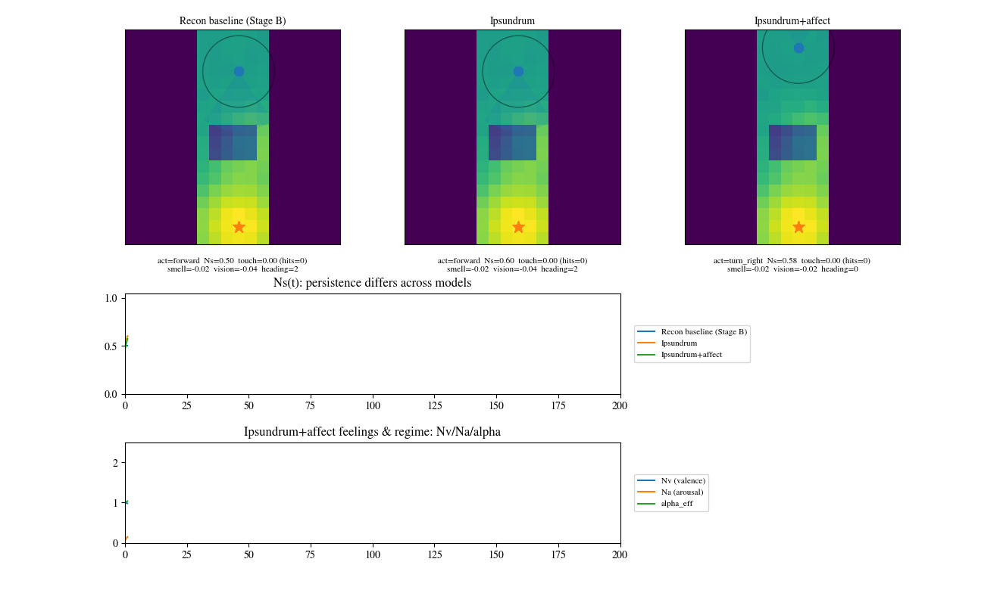
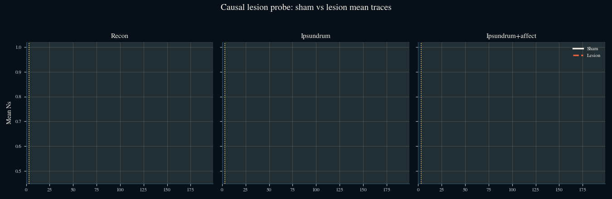
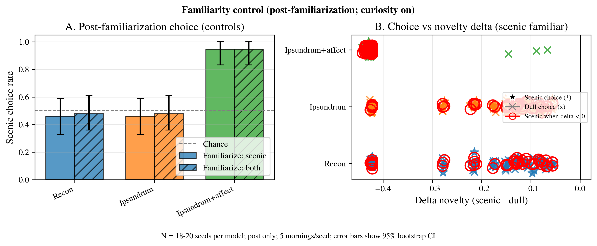
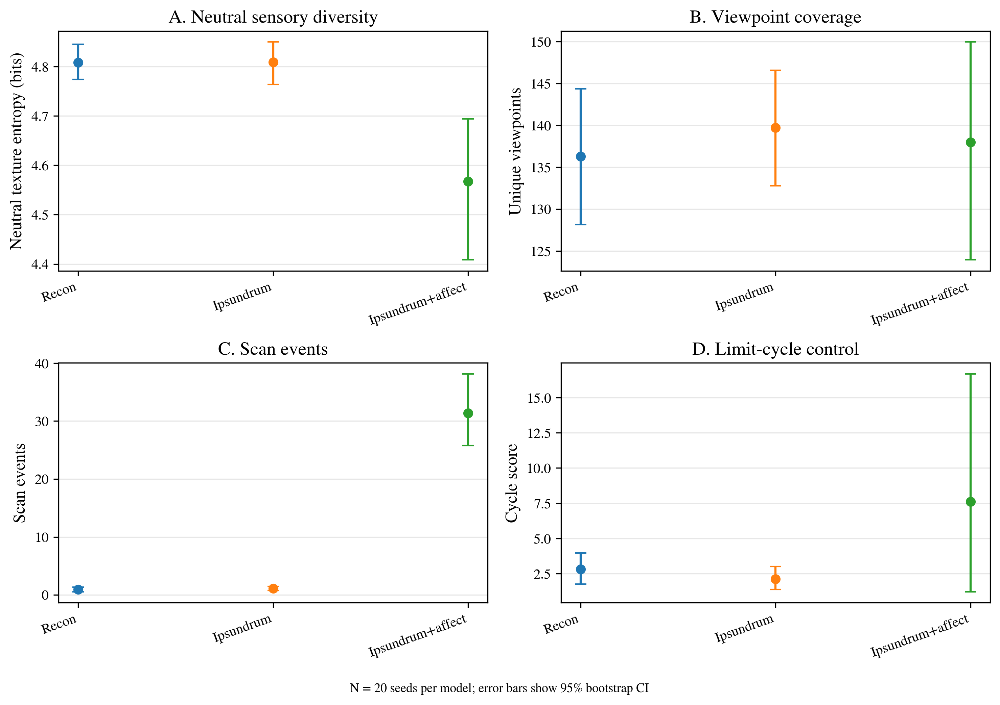
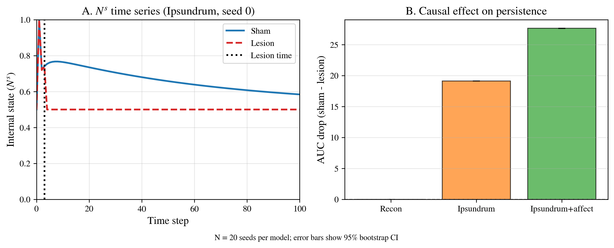

# ReCoN-Ipsundrum

Inspectable ReCoN-based agents with Humphrey-inspired recurrent persistence (“ipsundrum”) loop and affect-coupled control, plus mechanism-linked indicator assays (goal-directed tasks, exploratory play, familiarity/qualiaphilia, pain-tail, and causal lesions).

**Aishik Sanyal**

[Paper PDF](https://arxiv.org/pdf/2602.23232.pdf) | [arXiv Abstract](https://arxiv.org/abs/2602.23232) | [Author](https://xcellect.com)

## Key Animations

### Corridor rollout



### GridWorld rollout


### Mean lesion traces



## Key Figures

### Familiarity control



### Exploratory play



### Persistence and lesion summary



## BibTeX

```bibtex
@misc{sanyal2026reconipsundrum,
  title         = {ReCoN-Ipsundrum: An Inspectable Recurrent Persistence Loop Agent with Affect-Coupled Control and Mechanism-Linked Consciousness Indicator Assays},
  author        = {Aishik Sanyal},
  year          = {2026},
  eprint        = {2602.23232},
  archivePrefix = {arXiv},
  primaryClass  = {cs.AI},
  doi           = {10.48550/arXiv.2602.23232},
  url           = {https://arxiv.org/abs/2602.23232},
  note          = {Accepted at AAAI 2026 Spring Symposium - Machine Consciousness: Integrating Theory, Technology, and Philosophy}
}
```

## Quick Start: Run in Google Colab (One-Click)

Click the link below to open and run the demonstration notebook directly in Google Colab (no installation required):

**[Open Demo in Colab](https://colab.research.google.com/github/xcellect/recips/blob/main/playground.ipynb)**

## Setup

```bash
python -m venv .venv
source .venv/bin/activate
pip install -r requirements.txt
```

## Run the full experiment suite

`run_experiments.sh` executes the complete pipeline and writes artifacts to `results/` and logs to `logs/`.

```bash
# Full (paper) profile (more seeds; default)
./run_experiments.sh

# Faster smoke run
PROFILE=quick ./run_experiments.sh
```

Note: the script deletes and recreates `results/` and `logs/` at startup.

## Run tests

```bash
./run_pytest.sh
```

## Repository layout

- `core/`: ReCoN primitives and Ipsundrum(+affect) dynamics.
- `experiments/`: Assays and figure generation (used by `run_experiments.sh`).
- `analysis/`: “Claims-as-code” exports used by the paper and tables.
- `docs/paper-3-v9.tex`: Paper source (optionally includes `results/paper/claims.tex` if present).

## Build the paper PDF (optional)

Requires a LaTeX toolchain (e.g. `latexmk`). Running the experiments will automatically populate paper results.

```bash
cd docs
latexmk -pdf paper-3-v9.tex
```

## Build the project page

The static paper page lives in `paper-site/` and is generated from the current `results/` artifacts plus a few exported GIFs.

```bash
python3 -m analysis.build_paper_site
```

That command writes:

- `paper-site/static/data/site-data.json`
- `paper-site/static/media/*`

To preview locally:

```bash
python3 -m http.server 8000 --directory paper-site
```

A GitHub Pages workflow is included at `.github/workflows/deploy-paper-site.yml` and rebuilds/deploys the page from `main`.
